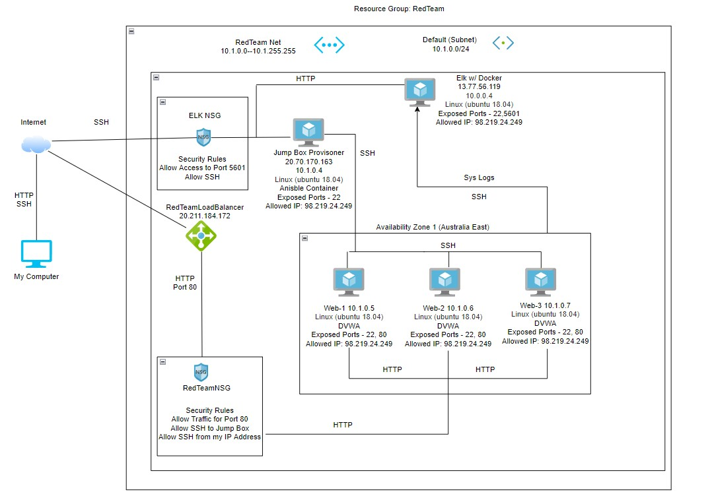
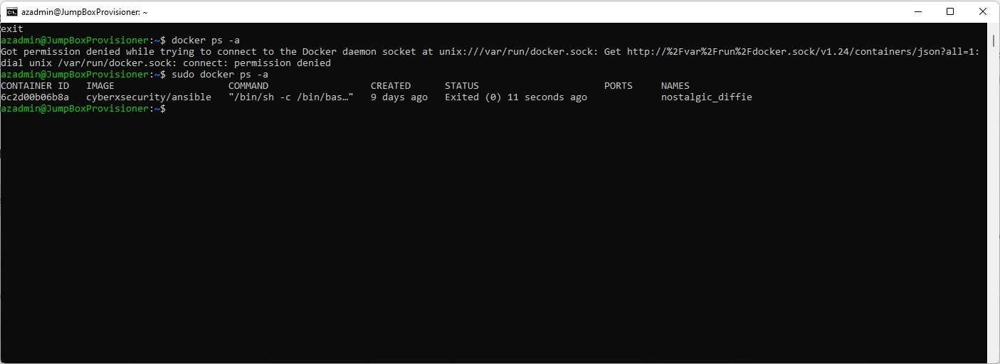

## Automated ELK Stack Deployment

The files in this repository were used to configure the network depicted below.

These files have been tested and used to generate a live ELK deployment on Azure. They can be used to either recreate the entire deployment pictured above. Alternatively, select portions of the filebeat_yaml file may be used to install only certain pieces of it, such as Filebeat.

This document contains the following details:
- Description of the Topology
- Access Policies
- ELK Configuration
  - Beats in Use
  - Machines Being Monitored
- How to Use the Ansible Build

### Description of the Topology

The main purpose of this network is to expose a load-balanced and monitored instance of DVWA, the D*mn Vulnerable Web Application.

Load balancing ensures that the application will be highly available, in addition to restricting access with a Jump Box to the network.

Integrating an ELK server allows users to easily monitor the vulnerable VMs for changes to the log data and system performance.
	
The configuration details of each machine may be found below.

| Name     | Function | IP Address | Operating System |
|----------|----------|------------|------------------|
| Jump Box | Gateway  |  10.0.0.1  |     Linux        |
| Web-1    |  Host    |  10.1.0.5  |     Linux        |
| Web-2    |  Host    |  10.1.0.6  |     Linux        |
| Web-3    |  Host    |  10.1.0.7  |     Linux        |
|Elk Server| Sys Log  |  10.0.0.4  |     Linux        | 

### Access Policies

The machines on the internal network are not exposed to the public Internet. 

Only the Jump Box Provisioner can accept connections from the Internet. Access to this machine is only allowed from the following IP addresses: Personal Public IP

Machines within the network can only be accessed by gaining access to the Jump Box Provisioner first. The Jump Box Provisioner’s IP address is 20.70.170.163

A summary of the access policies in place can be found in the table below.

| Name     | Publicly Accessible | Allowed IP Addresses |
|----------|---------------------|----------------------|
| Jump Box | Yes                 | Personal IP          |
|  Web-1   | No                  |   10.1.0.4           |
|  Web-2   | No                  |   10.1.0.4           |
|  Web-3   | No                  |   10.1.0.4           |
|ElkServer | Yes                 |  Personal IP         |

### Elk Configuration

Automating configurations with Ansible is helpful because it could save vast amounts of time if one had to manually configure hundreds of machines. It can be automated to handle configuring many machines with one command.

The playbook implements the following tasks:
- Install docker.io
- Install python3-pip
- Install docker module
- Increase systems virtual memory and allow for use of more memory
- Launch Elk docker container
- Enable Elk docker on boot.

The following screenshot displays the result of running `docker ps` after successfully configuring the ELK instance.

### Target Machines & Beats
This ELK server is configured to monitor the following machines:
- Web-1   10.1.0.5
- Web-2   10.1.0.6
- Web-3   10.1.0.7

We have installed Filbeat and Metricbeat on these machines. Filebeat collects log events while Metricbeat collects metrics of the systems and servers it monitors.

### Using the Playbook
To use the playbook, you will need to have an Ansible control node already configured. Assuming you have such a control node provisioned: 

SSH into the control node and follow the steps below:
- Copy the elk.yml file to etc/ansible folder in the ansible container.
- Update the hosts file to include [elk] with 10.0.0.4 ansible_python_interpreter=/usr/bin/python3.
- Run the playbook, and navigate to http://[your.VM.IP]:5601/app/kibana to verify that it is working. 

